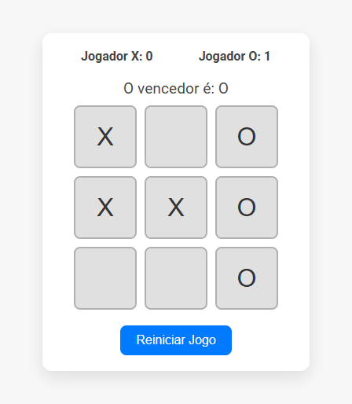

## Projeto Jogo Da Velha

* Projeto Desenvolvido em JavaScript (React), JSX (componentes React) e CSS.

# Como rodar o projeto

* Acesse a pasta do projeto:
cd JogoDaVelha

* Instale as dependências:
npm install

* Rode o projeto:
npm start
